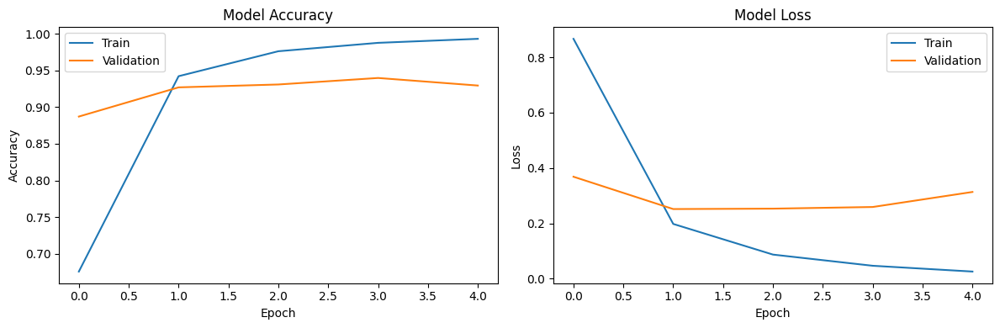

# Hate Speech Classification
### Overview
This Hate Speech Classification project aims to build a machine learning model for identifying hate speech in text data. The project involves extensive data preprocessing, exploratory data analysis (EDA), and the training of a Long Short-Term Memory (LSTM) neural network for hate speech classification.

### Data Preprocessing
The dataset used for this project is obtained from [UC Berkeley D-Lab](https://huggingface.co/datasets/ucberkeley-dlab/measuring-hate-speech). The data preprocessing involves removing duplicates, handling missing values, and cleaning the text data by removing URLs, mentions, digits, and other non-alphanumeric characters.

### Oversampling for Class Balance
To address the class imbalance issue, the majority class is oversampled to achieve a more balanced distribution. This step involves resampling the minority classes to match the count of the majority class.

### Tokenization and Model Building
Text data is tokenized, and sequences are prepared for training the LSTM-based neural network. The model architecture includes an embedding layer, LSTM layer, and dense layers for classification. The model is compiled with the Adam optimizer and sparse categorical crossentropy loss.

### Model Training and Evaluation
The model is trained on the preprocessed and oversampled data, with early stopping to prevent overfitting. The training history is visualized for accuracy and loss. The model is evaluated on a separate test set to assess its performance.

### Results

The project evaluates the hate speech classification model's accuracy and loss on both the training and validation sets, with 93.96% of accuracy on validation set.

### Credit
This project is inspired by and adapted from the "Belajar Pengembangan Machine Learning" course on [Dicoding](https://www.dicoding.com/) platform. The content and structure of this project draw upon the educational materials provided by Dicoding in the mentioned course.
